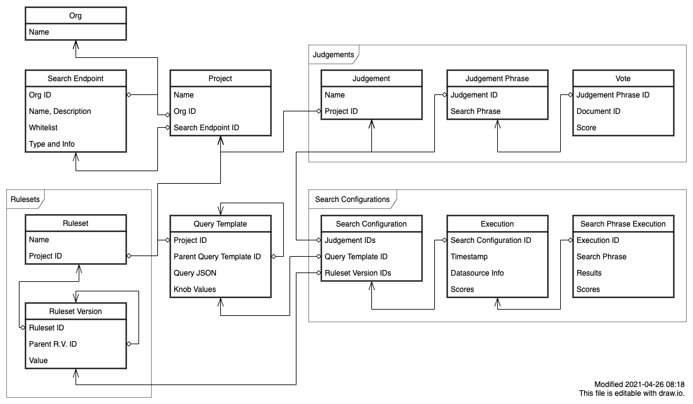

# Sierra Developer Guide

## Overview

### Libraries used

- The application is based on [Next.js](https://nextjs.org/docs/getting-started) and [Material UI](https://material-ui.com/getting-started/usage/) on the frontend.
- [Prisma 2](https://www.prisma.io/docs/concepts/overview/what-is-prisma) is used to interact with a PostgreSQL database. Prisma handles all migrations and also provides an admin GUI.
- [Zod](https://github.com/colinhacks/zod) is used for data validation. It's a TypeScript analog to Joi.
- [React Final Form](https://final-form.org/docs/react-final-form/getting-started) is used for managing form state, especially in combination with [mui-rff](https://github.com/lookfirst/mui-rff) for the integration between Material UI and React Final Form.

### General tips

#### In React code

- Links must be created with `components/common/Link`, which properly handles client-side routing and integrates with Material-UI.
- Most "global" data should be accessed through the methods in `components/Session`. This includes active Orgs and Projects.

#### In `getServerSideProps`

- Avoid using `lib/prisma` directly. Doing so bypasses all authentication checks and will lead to security problems.
- Similarly, always remember use the `formatWhatever` method before returning the props. These methods properly handle converting data to JSON-safe data.
- Use the functions in `lib/pageHelpers` whenever possible. Always use `authenticatedPage` to get access to the User object.

#### In API routes

- Use the functions in `lib/apiServer` whenever possible.

### File structure

| Directory                  | Description                                                  |
| -------------------------- | ------------------------------------------------------------ |
| `components/COMPONENT/...` | Reusable components related to the named component.          |
| `components/common/...`    | Reusable components that aren't specifically related to Sierra. |
| `lib/COMPONENT/...`        | Utility code related to the named component.                 |
| `lib/...`                  | Utility code that isn't React components.                    |
| `pages/api/COMPONENT/...`  | API methods related to the named component.                  |
| `pages/COMPONENT/...`      | Full-page React components related to the named component.   |
| `public/...`               | Static assets.                                               |
| `prisma/schema.prisma`     | The source of truth for the database layout.                 |
| `prisma/seed.ts`           | A script that is run whenever the development database is reset. |
| `prisma/migrations/...`    | Migrations, typically generated by Prisma.                   |
| `styles/...`               | CSS files, prefer using Material `makeStyles` instead.       |

### Data model

The data model is described in `prisma/schema.prisma`, and is the source of truth for the database schema. Read this file for documentation. Here is a diagram which shows the major components of the system. Note: this diagram is meant to be explanatory. It does not show all of the fields or tables. Consult the schema file for the true, complete schema.



There are a few important organizational constructs as well.

#### Active Org

The active org is tracked for a User and for each tab. To determine which Org is active in a particular context:

- For API routes, there is no active Org. The desired Org must be passed in as a request parameter.
- For `getServerSideProps`, use `requireActiveOrg` from `lib/pageHelpers`. This method will also handle the case where a new user doesn't have have an Org.
- For anywhere else, use `useActiveOrg` from `components/Session`.

#### Active Project

The active Project is purely a client-side concept, and is used to jump between projects in the navigation. If you need to know it:

- For API routes, there is no active Project. The desired Project must be passed in as a request parameter.
- For `getServerSideProps`, find the Project by navigating relationships from the object you are writing.
- For anywhere else, use `useActiveProject` from `components/Session`.

## Runbook

### Set up development environment (first time)

Set up a Google app for SSO. From [the console](https://console.cloud.google.com/apis/credentials), create an "OAuth client ID". The only important setting is the "Authorized redirect URIs", which must be `http://localhost:3000/api/auth/callback/google`. Note the "Client ID" and "Client secret".

```bash
docker-compose -f docker-compose.local.yml up -d
./bin/seed_elasticsearch.sh # Load the icecat dataset into Elasticsearch
cp .env.sample .env.local # Edit the .env file appropriately.
yarn prisma migrate reset # Create the Postgres schema
yarn dev # Start the server
```

Once the server is running, you need to set up the internal data structures:

1. Log into the site using a google account that matches `ALLOW_REGISTRATION_FROM` in `.env`.
2. Open http://localhost:3000/dev and use the Seed function to populate the sample data.

### Set up development environment (normal)

```bash
docker-compose -f docker-compose.local.yml up -d
yarn dev
```

To access the Prisma database admin management console, use:

```bash
prisma studio
```

If the database schema is out of date, you should toss your local database and recreate it:

```bash
prisma migrate reset --force
```

### Run the tests

```bash
yarn db:reset:test # Reset the test database
yarn test # Run the tests
```

### Modify the database schema (before initial launch)

During early development, we don't add new Prisma migrations and instead completely recreate the database in a single migration when the schema changes. To do this, after making changes to `prisma/schema.prisma`, then:

```bash
rm -rf prisma/migrations
yarn prisma migrate dev --create-only --skip-seed
yarn prisma migrate reset --force
```

### Modify the database schema

Make your change to `prisma/schema.prisma`, then:

```bash
prisma migrate dev
```

### Build the docker image

```bash
yarn
yarn build
docker build . -t sierra
```
